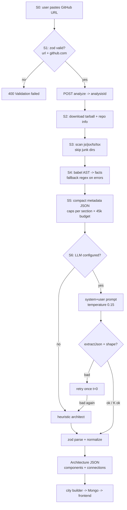

# Pipeline — User GitHub URL → JSON → AI

Stage-by-stage pipeline contract. Each stage shows **input → transform → output**.
Companion to [`GITHUB_URL_AI_WORKFLOW.md`](GITHUB_URL_AI_WORKFLOW.md) (which covers the full app flow); this doc isolates the URL→AI-JSON pipeline.

```
S0        S1           S2          S3            S4            S5            S6
URL ──► Validate ──► Download ──► Scan files ──► Parse AST ──► Build JSON ──► Send to AI
user     repoUrl      tarball      .js/.ts only   facts/file    compact       prompt pair
         + dedupe     + extract    junk skipped   fallback      ≤45k chars    t=0.15
```

---

## S0 — Entry: user submits URL

| | |
| :--- | :--- |
| **Trigger** | User pastes URL into HUD / landing form |
| **Input** | raw string e.g. `github.com/owner/repo` |
| **Frontend normalize** | prepend `https://` if missing (`HUD.tsx`) |
| **Auth** | Bearer JWT required |
| **Output** | `{ name, repoUrl }` |

## S1 — Project create + validate

`POST /api/v1/projects` → zod gate:

```ts
name:    string.trim().min(1).max(120)
repoUrl: string.trim().url() AND /github\.com/i     // MVP: GitHub only
```

- Duplicate `(owner, repoUrl)` → existing project returned instead of error.
- Then `POST /api/v1/projects/:id/analyze` → `202 { analysisId }`, pipeline runs async.

## S2 — Fetch repository (`github.service.downloadAndExtractRepo`)

| Input | Transform | Output |
| :--- | :--- | :--- |
| `repoUrl` | GET repo meta (`fullName`, default branch, language, stars) · download tarball · extract temp dir | `{ dir, info, cleanedUp }` |
| Progress emit | `analysis:progress { step:"github", percent:2 }` | — |

## S3 — File scanner

| Rule | Value |
| :--- | :--- |
| Extensions kept | `.js` `.jsx` `.ts` `.tsx` |
| Skipped dirs | `node_modules`, `dist`, `build`, `.git`, coverage, … (hits recorded) |
| Cap | max N files; `truncated` flag set |
| Output | `scan.files[]` (repo-relative paths) |

Progress: `step:"scan", percent:10`.

## S4 — Parse & analyze each file (fault-tolerant)

Per file, two paths:

```
source ──► @babel/parser ──► AST ──► ast-analyzer ──► facts.json
                │ 90% of files                        ▲
                └── SyntaxError ──► fallback-extractor ┘   (regex heuristics)
```

Facts extracted per file:

| Fact | Example |
| :--- | :--- |
| role | `entry` \| `component` \| `route` \| `model` \| `service` \| … |
| routes | `{ method:"POST", path:"/login", handler:"authController.login" }` |
| models | `{ name:"User", collection:"users", fields:[…] }` |
| controllers / services / classes | names + defining file |
| imports | module specifiers |

Progress: `step:"parse", percent 10→70` per file batch. Failures collected in `failures[]` (≤50 stored), never abort the run.

## S5 — Build the compact JSON for the AI (`metadata.builder` → `compactMetadataForPrompt`)

Merged `ProjectMetadata` is compressed into the AI payload:

```jsonc
{
  "project":         { "name":"…", "repo":"owner/repo", "branch":"main",
                       "description":"…", "primaryLanguage":"TypeScript" },
  "stats":           { /* counts */ },
  "dependencies":    ["express","mongoose"],        // names only, max 60
  "devDependencies": ["typescript"],                // max 40
  "routes":          [/* max 80 */],
  "models":          [/* max 40 */],
  "controllers":     [/* max 40 */],
  "services":        [/* max 40 */],
  "authIndicators":  { "jwtLibraryUsed": true },
  "keyClasses":      [/* max 40 */],
  "filesByRole":     { "entry":1, "component":58 }, // counts, not paths
  "sampleImports":   ["react","axios"]              // max 50
}
```

**Budget guard:** serialize → if `> 45_000` chars → hard truncate + `"TRUNCATED"` marker.
**Privacy guarantee:** raw source code and ASTs never leave the server.

## S6 — Send to AI (`architect.service.generateWithLlm`)

Messages sent to any OpenAI-compatible endpoint:

| Role | Content |
| :--- | :--- |
| system | senior-architect persona + **exact output schema** + rules (4–25 components, stable kebab ids, connection endpoints must exist, JSON-only) |
| user | `"Analyze this codebase summary and produce the architecture JSON.\n\n<compact JSON>"` |

Params: `temperature = 0.15`.

### Expected AI reply (the JSON contract)

```jsonc
{
  "components": [
    { "id":"auth-routes", "name":"Auth Routes", "type":"routes",
      "description":"HTTP endpoints for auth.", "files":["src/routes/auth.routes.ts"] }
    // type ∈ frontend|routes|controller|service|model|database|
    //        middleware|auth|integration|config|external ; 4–25 total
  ],
  "connections": [
    { "from":"frontend", "to":"auth-routes", "label":"sends requests" }
    // label = short verb: calls / delegates to / persists to / guards …
  ]
}
```

### Response hardening chain

```
reply ─► extractJson() ─► shape ok? ──yes─► parseRawArchitecture (zod)
                 │ no                        │
                 └─ retry once (t=0,         ├─► normalizeArchitecture()
                    corrective nudge) ───────┘    (slug ids, dedupe,
                                                  drop dangling edges)
LLM totally unavailable/bad ──► generateHeuristic(metadata)  engine:"heuristic"
Success                        ──►                           engine:"llm"
```

## S7+ — After the AI (context)

Architecture JSON → `city.builder` (districts, positions, visuals, diff) → MongoDB Analysis doc → REST `/architecture` + Socket.IO room events → Three.js city. Detailed in the workflow doc §6–7.

---

## Mermaid flowchart


