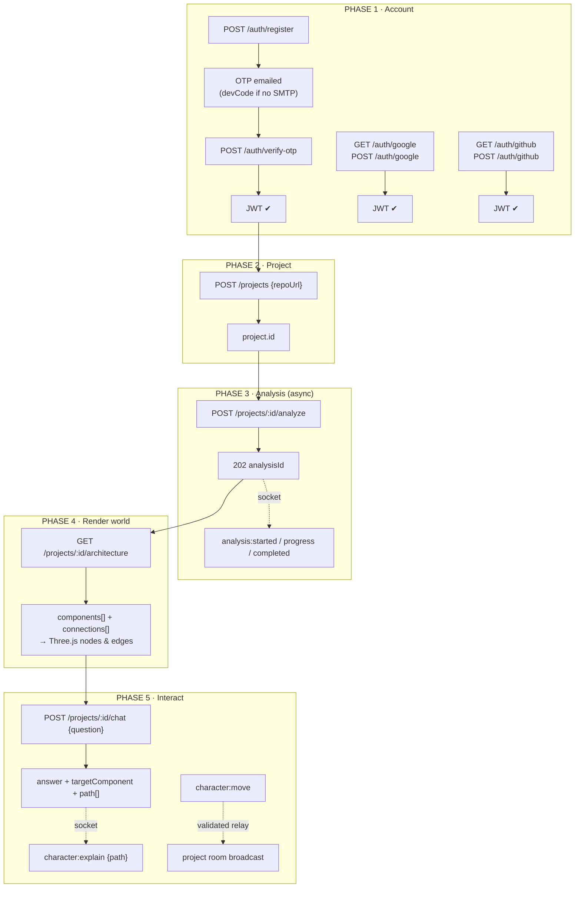

# API Workflow — Software World Backend

Complete visual guide: how every request flows, in order, with exact JSON.
Companion files: `API_ENDPOINTS.json` (machine-readable list) · `JSON.md` (payload contracts).

---

## 1. The Big Picture

```
┌──────────┐   repoUrl    ┌─────────────────────────────────────────────┐
│ Frontend │ ───────────► │  Backend                                    │
│ (Three.js│              │                                             │
│  world)  │   JWT        │  GitHub API ──► tarball ──► scanner         │
└────▲─────┘              │                    (.js/.jsx/.ts/.tsx only) │
     │                    │                        │                    │
     │    REST + Socket   │                        ▼                    │
     └────────────────────│              Babel AST ➜ ast-analyzer      │
                          │                        │                    │
                          │                        ▼                    │
                          │           compact ProjectMetadata JSON      │
                          │                        │                    │
                          │                        ▼                    │
                          │            LLM (or heuristic fallback)      │
                          │                        │                    │
                          │                        ▼                    │
                          │        validated Architecture JSON          │
                          │                        │                    │
                          │                        ▼                    │
                          │                   MongoDB                   │
                          └─────────────────────────────────────────────┘
```

---

## 2. Full Workflow Diagram (phases 1 → 6)



---

## 3. Sequence — the Golden Demo

```
Frontend                     Backend                         GitHub / LLM / Mongo
   │  POST /auth/register       │                                │
   │ ──────────────────────────►│── create user(isVerified:false)│
   │                            │── email OTP ──────────────────►│ ✉
   │  ◄─ { message, devCode? }  │                                │
   │  POST /auth/verify-otp     │                                │
   │ ──────────────────────────►│── check hash, mark verified    │
   │  ◄─ { token }              │                                │
   │  POST /projects {repoUrl}  │                                │
   │ ──────────────────────────►│── save project(owner=you)      │
   │  ◄─ { project.id }         │                                │
   │  POST /projects/:id/analyze│                                │
   │ ──────────────────────────►│── create Analysis(running) ────│
   │  ◄─ 202 {analysisId}       │                                │
   │      ⇠ socket: analysis:started                             │
   │                            │── GET repos/:o/r ─────────────►│
   │                            │◄─ metadata, default branch ────│
   │                            │── codeload tarball ───────────►│
   │      ⇠ analysis:progress   │── extract, scan, parse+analyze │
   │                            │── compact metadata ───────────►│ LLM
   │                            │◄─ architecture JSON ───────────│
   │                            │── validate+normalize, save ────│ Mongo
   │      ⇠ analysis:completed  │                                │
   │  GET /projects/:id/architecture                             │
   │ ──────────────────────────►│── load latest completed ───────│
   │  ◄─ { components[], connections[] }                         │
   │  POST /projects/:id/chat {"question": "..."}                │
   │ ──────────────────────────►│── graph pathfinding (+LLM) ────│
   │  ◄─ {answer,targetComponent,path[]}                        │
   │      ⇠ character:explain {path}                             │
   ▼  animate character along path                               │
```

---

## 4. Every API — method, auth, request/response JSON

> Base `http://localhost:5000` · private calls need header
> `Authorization: Bearer <token>` · all responses `{ success, ... }`

### 🔓 Auth — Phase 1

#### `POST /api/v1/auth/register`
```json
// request
{ "name": "Gautam", "email": "gautam@test.com", "password": "passw0rd123" }
// response 201
{ "success": true,
  "message": "Verification code sent to gautam@test.com. It expires in 10 minutes.",
  "devCode": "166539" }
```
`devCode` appears ONLY when SMTP is unset (dev). Errors: `400` validation · `409` already verified.

#### `POST /api/v1/auth/verify-otp`
```json
{ "email": "gautam@test.com", "code": "166539" }
// 200
{ "success": true,
  "data": { "user": { "id": "...", "email": "...", "name": "...", "provider": "local",
                      "avatarUrl": null, "isVerified": true },
            "token": "eyJhbGci..." } }
// 400 wrong code -> "Wrong code. 4 attempts left." · expired · max 5 attempts
```

#### `POST /api/v1/auth/resend-otp`
```json
{ "email": "gautam@test.com" }
// 200 { "success": true, "message": "New verification code sent...", "devCode"? }
// 429 within 60s cooldown
```

#### `POST /api/v1/auth/login`
```json
{ "email": "gautam@test.com", "password": "passw0rd123" }
// 200 -> same data shape as verify-otp ({user, token})
// 403 unverified:
{ "success": false,
  "message": "Please verify your email first — we sent you a fresh code.",
  "details": { "needsVerification": true, "email": "..." , "devCode": "..." } }
```

#### `POST /api/v1/auth/forgot-password` → `POST /api/v1/auth/reset-password`
```json
// forgot request/response (anti-enumeration: same reply always)
{ "email": "gautam@test.com" }
{ "success": true, "message": "If that account exists, a reset code has been sent.", "devCode"? }

// reset request
{ "email": "gautam@test.com", "code": "308977", "newPassword": "newpass9x" }
// 200 { "success": true, "data": { "message": "Password updated. You can now log in." } }
```

#### OAuth Google / GitHub
| Call | Flow |
|---|---|
| `GET /api/v1/auth/google` | browser redirect → consent → callback redirects to `<FRONTEND_URL>/auth/success?token=<APP_JWT>&email&name` |
| `POST /api/v1/auth/google` `{ "credential": "<GOOGLE_ID_TOKEN>" }` | SPA button flow → `200 {data:{user,token}}` |
| `GET /api/v1/auth/github` + callback | same redirect dance |
| `POST /api/v1/auth/github` `{ "code": "<AUTH_CODE>" }` | SPA exchange → `200 {data:{user,token}}` |

Failure redirect: `<FRONTEND_URL>/auth?error=<message>`.

#### `GET /api/v1/auth/me` *(JWT)*
```json
{ "success": true, "data": { "user": { "id": "...", "email": "...", "name": "..." } } }
```

---

### 📁 Projects — Phase 2 *(all JWT)*

#### `POST /api/v1/projects` ← **upload GitHub repo URL here**
```json
{ "name": "My Repo",
  "description": "optional text",
  "repoUrl": "https://github.com/gautamvaishnav1/firstReactProject" }
// 201
{ "success": true,
  "data": { "project": {
      "id": "6a89c763fba6f11f175c0fbc",
      "name": "My Repo", "description": "",
      "repoUrl": "https://github.com/gautamvaishnav1/firstReactProject",
      "ownerId": "6a89a00eed...",
      "lastAnalysisId": null, "createdAt": "...", "updatedAt": "..." } } }
```
Accepted URLs: `github.com/o/r`, `…/r.git`, `git@github.com:o/r.git`, `…/tree/<branch>`.
Errors: `400` not GitHub · `409` duplicate URL for your account.

#### `GET /api/v1/projects` — your projects only
```json
{ "success": true,
  "data": { "projects": [
    { "id": "6a89c763...", "name": "FirstReactProject",
      "repoUrl": "https://github.com/gautamvaishnav1/firstReactProject",
      "description": "", "ownerId": "...", "lastAnalysisId": null } ] } }
```

#### `GET /api/v1/projects/:id` · `DELETE /api/v1/projects/:id`
```json
// get 200 -> { success, data:{ project:{...same shape as above} } }
// delete 200 -> { "success": true, "message": "Project deleted" }
// 403 if not yours · 404 unknown
```

---

### ⚙️ Analysis — Phase 3 *(all JWT)*

#### `POST /api/v1/projects/:id/analyze`
No body. **202** immediately; work continues in background:
```json
{ "success": true, "message": "Analysis started",
  "data": { "analysisId": "6a89d799...",
            "projectId": "6a89c763...",
            "socketRoom": "project:6a89c763..." } }
```
Errors: `409` already running · `404` unknown project · `502` GitHub down/not found/rate-limited.

#### `GET /api/v1/analyses/:analysisId/status` (polling fallback)
```json
{ "success": true,
  "data": { "id": "...", "status": "running | completed | failed",
            "durationMs": 2611, "error": null } }
```

#### `GET /api/v1/projects/:id/architecture` ⭐ main payload for the 3D frontend
```json
{
  "success": true,
  "data": {
    "analysisId": "6a89d799...",
    "repoInfo": { "fullName": "gautamvaishnav1/firstReactProject",
                  "defaultBranch": "main", "primaryLanguage": "JavaScript", "stars": 0 },
    "stats": { "filesConsidered": 16, "filesParsedBabel": 16, "filesFallback": 0,
               "totalRoutes": 2, "totalModels": 0, "aiEngine": "heuristic|llm",
               "durationMs": 93 },
    "architecture": {
      "components": [
        { "id": "frontend", "type": "frontend",
          "name": "Frontend App",
          "description": "14 UI component file(s) rendering the user interface.",
          "files": ["src/App.jsx", "src/components/CountryCard.jsx"] },
        { "id": "axiosapi-routes", "type": "routes",
          "name": "Axiosapi Routes",
          "description": "HTTP endpoints for axiosapi (GET /all?fields=..., ...).",
          "files": ["src/routes/axiosApi.routes.js"] }
      ],
      "connections": [
        { "from": "frontend", "to": "axiosapi-routes", "label": "sends requests" },
        { "from": "axiosapi-routes", "to": "axiosapi-controller", "label": "delegates to" }
      ]
    }
  } }
```
Guarantees: ids are unique kebab-case slugs · every connection endpoint exists in components ·
`type ∈ frontend|routes|controller|service|model|database|middleware|auth|integration|config|other`.

#### `GET /api/v1/analyses/:id` — everything (metadata incl. routes/models/functions, failures[])
Same shape as architecture plus `"metadata"` (the compact ProjectMetadata that went to the AI)
and `"failures": [{ "file","error","strategy":"fallback|skipped" }]`.

---

### 💬 AI Chat — Phase 5 *(JWT, rate-limited 30/min)*

#### `POST /api/v1/projects/:id/chat`
```json
{ "question": "How does authentication work?" }
// 200
{ "success": true,
  "data": {
    "answer": "Authentication starts at the auth routes, which delegate to the auth controller...",
    "targetComponent": "auth-middleware",
    "path": ["frontend", "app-routes", "auth-middleware"],
    "relatedComponents": ["app-routes", "auth-routes", "user-model"] } }
```
`targetComponent` may be `null` (no good match) · every id is guaranteed to exist in that
project's stored architecture · also emits `character:explain` to the room.
`404` if no completed analysis yet.

---

## 5. Socket.IO event flow

```
connect(io(url,{auth:{token}}))          JWT handshake — invalid token = rejected
   │
   ├─ emit project:join {projectId}  ──► ownership check ──► ack {ok:true,room}
   │
   │   ═══ during analysis ═══
   ◀─ analysis:started   {analysisId, projectId, repoUrl}
   ◀─ analysis:progress  {analysisId, step:"github|scan|parse|ai|save", percent, current, total}
   ◀─ analysis:completed {analysisId, stats{...}, architecture{componentCount,...}, engine}
   ◀─ analysis:failed    {analysisId, error}
   │
   │   ═══ character (semantic IDs ONLY — frontend owns coordinates/animation) ═══
   ├─ emit character:move   {projectId, toComponentId}      ──► id validated ──► room ◀ broadcast
   ├─ emit character:explain{projectId, path:[ids]}          ──► invalid ids dropped
   ◀─ character:move    {projectId, fromComponentId, toComponentId}
   ◀─ character:explain {projectId, path[], targetComponent?, question?}
```

---

## 6. Error contract (every endpoint)

```json
{ "success": false, "message": "Validation failed",
  "details": [{ "field": "email", "message": "Must be a valid email" }] }
```

| Status | Meaning |
|---|---|
| 400 | validation / malformed JSON / bad OTP |
| 401 | missing or expired JWT |
| 403 | resource belongs to another user / email unverified |
| 404 | route, project, analysis not found |
| 409 | duplicate email/project URL · analysis already running |
| 422 | AI output failed strict validation |
| 429 | rate limited (global 600/15m · auth 25/15m · OTP 12/10m · AI/chat 30/min) |
| 502 | GitHub or LLM upstream failure |

---

## 7. Quick local test order (Bruno/curl)

```
1  GET  /health
2  POST /api/v1/auth/register        → devCode
3  POST /api/v1/auth/verify-otp      → TOKEN
4  GET  /api/v1/auth/me
5  POST /api/v1/projects             → PROJECT_ID
6  GET  /api/v1/projects
7  POST /api/v1/projects/:id/analyze → ANALYSIS_ID
8  GET  /api/v1/analyses/:id/status  (until completed)
9  GET  /api/v1/projects/:id/architecture
10 POST /api/v1/projects/:id/chat
11 DELETE /api/v1/projects/:id      (cleanup)
```
