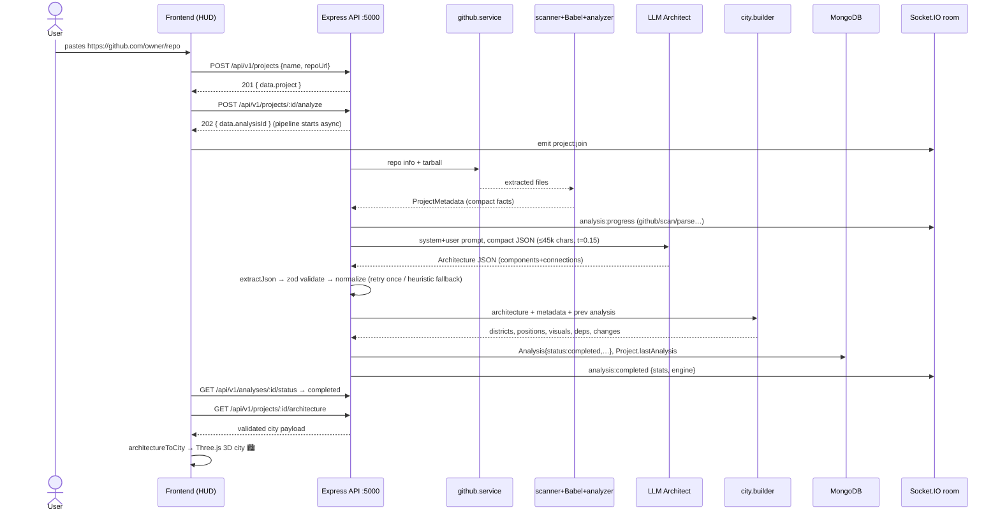

# Workflow — GitHub URL → AI → Architecture JSON

End-to-end trace of what happens when a user pastes a GitHub repository URL,
based on the actual code (`Backend/src/modules/**`, `frontend/src/lib/api.ts`, `frontend/src/ui/HUD.tsx`).

---

## 0. Big picture

```
User pastes URL
      │
      ▼
┌─────────────────────── FRONTEND (React, :5199) ───────────────────────┐
│ HUD.load():                                                           │
│   1. POST /api/v1/projects                → creates Project           │
│   2. POST /api/v1/projects/:id/analyze    → returns analysisId (202)  │
│   3. GET  /api/v1/analyses/:id/status     → poll until completed      │
│   4. GET  /api/v1/projects/:id/architecture → fetch final city        │
│   (+ Socket.IO room join for live progress)                           │
└───────────────────────────────┬───────────────────────────────────────┘
                                ▼
┌─────────────────────── BACKEND (Express :5000) ───────────────────────┐
│ fire-and-forget pipeline (analysis.pipeline.ts):                      │
│   github → scan → babel AST → analyzer JSON → metadata builder        │
│        → AI ARCHITECT (compact JSON in → Architecture JSON out)       │
│        → validate/normalize → city builder → MongoDB                  │
│ Live progress over Socket.IO: analysis:started/progress/completed     │
└───────────────────────────────────────────────────────────────────────┘
```

---

## 1. User pastes a GitHub URL (frontend)

`HUD.tsx → load(url)`:

| Step | Request | Response used |
| :--- | :--- | :--- |
| 1 | `POST /api/v1/projects` body `{ name: "<repo-name>", repoUrl: "<url>" }` | `data.project.id` |
| 2 | `POST /api/v1/projects/:id/analyze` (Bearer JWT) | `data.analysisId` — **returns immediately (202)**, pipeline runs async |
| 3 | `GET /api/v1/analyses/:analysisId/status` — polled every few sec | `data.status`: `running \| completed \| failed` |
| 4 | `GET /api/v1/projects/:id/architecture` | validated city payload (see §7) |

Meanwhile the socket joins room `project:<projectId>` and receives live progress.

> Backend guards: JWT required · rate-limited (`aiLimiter`) · **one analysis at a time per project** (`409 Conflict` otherwise).

---

## 2. Pipeline stages (backend, `analysis.pipeline.ts`)

Progress is broadcast as `analysis:progress { step, percent }` into the project room:

```
github  (2%)  ──►  scan  (10%)  ──►  parse  (10→70%)  ──►  ai  (75%)  ──►  city  (85%)  ──►  save  (92%)
```

### Step 1 — `github.service.downloadAndExtractRepo(repoUrl)`
- Calls GitHub API for repo info (full name, default branch, primary language, stars).
- Downloads the **tarball**, extracts to a temp dir.
- Returns `{ dir, info, cleanedUp }`.

### Step 2 — `file-scanner`
- Keeps only `.js .jsx .ts .tsx`.
- Skips junk dirs (`node_modules`, `dist`, `.git`, …) — ignored dirs are recorded.
- Caps the file count (truncation flag saved).

### Step 3 — `babel.parser` + `ast-analyzer` (per file)
- Babel parses source → AST (**parses only — no execution**).
- `ast-analyzer` walks the AST and extracts compact facts per file:
  - role (`entry` / `component` / `route` / `model` / `service` / …),
  - Express routes (`method`, `path`, `handler`),
  - Mongoose models (`name`, `collection`, fields),
  - controllers, services, classes, imports.
- A broken/unparseable file goes to the **regex fallback-extractor** instead of failing the run.
- Result merged by `metadata.builder` into one **ProjectMetadata** object.

---

## 3. What is given to the AI

`ai.prompts.ts → compactMetadataForPrompt(metadata)` builds a **compact JSON summary — never raw ASTs**:

```jsonc
{
  "project":         { "name": "...", "repo": "owner/repo", "branch": "main" },
  "stats":           { "filesConsidered": 214, "totalRoutes": 23, "totalModels": 6 },
  "dependencies":    ["express", "mongoose", "socket.io"],          // max 60 names
  "devDependencies": ["typescript", "vitest"],                      // max 40 names
  "routes":          [{ "method": "POST", "path": "/login", "handler": "authController.login", "file": "src/routes/auth.routes.ts" }], // max 80
  "models":          [{ "name": "User", "collection": "users", "fields": ["email", "passwordHash"] }],                    // max 40
  "controllers":     [{ "name": "authController", "file": "..." }],  // max 40
  "services":        [{ "name": "otpService", "file": "..." }],      // max 40
  "authIndicators":  { "jwtLibraryUsed": true },
  "keyClasses":      ["..."],                                        // max 40
  "filesByRole":     { "entry": 1, "component": 58, "model": 6 },    // role → count map
  "sampleImports":   ["react", "axios"]                              // max 50
}
```

Hard context budget: **45,000 chars** — truncated safely if exceeded.

### The prompt pair
- **system**: *"You are a senior software architect… reply with ONLY valid JSON"* + exact output schema + rules (group files into semantic components like `auth-routes`; 4–25 components; stable kebab-case ids; every connection endpoint must exist).
- **user**: `"Analyze this codebase summary and produce the architecture JSON.\n\n<compact JSON>"`

Call: `chatCompletion(messages, temperature = 0.15)` against any OpenAI-compatible API.
No `LLM_API_KEY` configured → deterministic **heuristic mode** (§5).

---

## 4. What the AI generates (Architecture JSON)

```jsonc
{
  "components": [
    {
      "id": "auth-routes",                       // stable kebab-case id (drives the 3D map)
      "name": "Auth Routes",
      "type": "routes",                          // frontend | routes | controller | service | model
      "description": "HTTP endpoints for auth.",// database | middleware | auth | integration | config | external
      "files": ["src/routes/auth.routes.ts"]
    }
    // … 4–25 components total
  ],
  "connections": [
    { "from": "frontend", "to": "auth-routes", "label": "sends requests" },
    { "from": "auth-routes", "to": "auth-controller", "label": "delegates to" }
  ]
}
```

### Validation & recovery (`architecture.schema.ts`)
1. `extractJson()` pulls the JSON blob out of the reply (tolerates fences/prose).
2. Shape wrong? → **one automatic retry** at `temperature 0` with corrective nudge: *"Reply again with ONLY the JSON object having components and connections."*
3. Zod `rawArchitectureSchema` validates & coerces.
4. `normalizeArchitecture()` slugifies ids, dedupes, drops connections pointing at missing components.
5. LLM still failing → **heuristic fallback**, so an analysis never dies because of the AI.

---

## 5. Heuristic fallback (no key / bad LLM reply)

Rule-based architect (`generateHeuristic`) — same Architecture JSON shape:
- `frontend` component when JSX/component files or React/Vue deps exist.
- Per feature (`auth.routes.ts` → feature `auth`): `<feature>-routes` → `<feature>-controller`, plus shared `auth-middleware` guard when route handlers look protected.
- Services link `controller → calls → service`; models link `service/model → persists to → mongodb-database`.
- Known SDKs (stripe, openai, twilio, axios…) → `external-services` component.
- Degenerate repos collapse to a single `core-codebase` component; graph is never fully disconnected.

Result reports which engine ran: `{ architecture, engine: "llm" | "heuristic" }` — stored in stats as `aiEngine`.

---

## 6. Post-AI: city building & persistence

`city.builder.buildCityWorld(architecture, metadata, previousArchitecture)`:
- Assigns **districts** (by component type), x/z **positions**, building height/color from `visual.complexity` / `visual.importance`,
- computes dependency groups (`runtime` / `dev`), `techStack`, and a **diff vs the previous analysis** (`changes`: added/removed/changed components).

Deterministic telemetry:
- `healthScore = clamp(100 − avgComplexity·0.45 − failureRatio·40, 5…100)`
- `bottlenecks` = top 3 components with complexity ≥ 60.

Everything is persisted on the Analysis document in MongoDB:
`repoInfo, stats(+aiEngine,+healthScore,+bottlenecks), metadata, architecture, districts, dependencies, techStack, changes, failures(≤50), durationMs` — then `Project.lastAnalysis = analysisId`, and the room gets `analysis:completed` (or `analysis:failed` with error message).

---

## 7. What the frontend finally receives

`GET /api/v1/projects/:id/architecture` →

```jsonc
{
  "success": true,
  "data": {
    "analysisId": "…",
    "projectId": "…",
    "repoInfo": { "fullName": "owner/repo", "defaultBranch": "main", "primaryLanguage": "TypeScript", "stars": 42 },
    "stats":    { "…scannedFiles, healthScore, bottlenecks, aiEngine…" },
    "districts": [ { "id": "backend", "color": "#22d3ee", "…bounds…" } ],
    "architecture": { "components": [ /* ids, types, districts, positions, visuals */ ],
                      "connections": [ { "from", "to", "label" } ] },
    "dependencies": { "runtime": ["express"], "dev": ["typescript"] },
    "changes": { /* diff vs previous run or null */ }
  }
}
```

The HUD converts this via `architectureToCity()` into the Zustand store → Three.js renders buildings/roads; `joinProjectRoom()` keeps realtime events flowing.

---

## 8. Sequence diagram



---

## 9. Failure modes & guarantees

| Situation | Behaviour |
| :--- | :--- |
| Repo private / not found | pipeline fails → `status:"failed"` + `analysis:failed` event |
| File unparseable | regex fallback extractor, counted in `stats.filesFallback` |
| LLM unreachable / bad JSON | 1 retry at temp 0 → else heuristic engine (never blocks demo) |
| Second analyze while running | `409 Conflict` |
| Huge repo | scanner truncates; metadata capped per section; prompt hard-capped at 45k chars |
| No completed analysis yet | `GET …/architecture` → 404 with hint to run analyze first |
